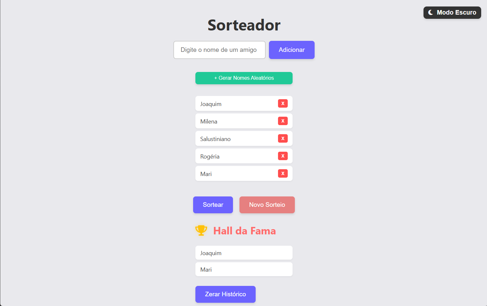

# 🎉 Super Sorteador


Este é um projeto de um **Sorteador de Amigos** dinâmico e interativo, desenvolvido para colocar em prática conceitos fundamentais e avançados de Desenvolvimento Web Front-End. O aplicativo foi transformado de uma lista simples para uma experiência imersiva de "programa de TV", com efeitos sonoros, suspenses visuais e animações.

---

## 🚀 Funcionalidades (Features)

- **Validação Inteligente:** O sistema possui um "faxineiro" de textos (`.trim()`) que impede a adição de nomes invisíveis ou compostos apenas por espaços.
- **Efeito Roleta de Suspense:** Ao clicar em sortear, a tela pisca nomes aleatórios rapidamente (`setInterval`) durante 2.5 segundos acompanhando o som de tambores.
- **Animações de Vitória:** O vencedor é revelado em grande destaque com uma explosão de confetes na tela (Canvas Confetti).
- **Efeitos Sonoros:** Sons imersivos de tambores para o suspense e aplausos para a revelação do campeão, com controlo de volume otimizado.
- **Hall da Fama (Histórico):** Guarda uma lista de todos os campeões dos sorteios anteriores.
- **Persistência de Dados (Banco de Dados):** Tanto a lista de amigos quanto o Hall da Fama utilizam o `localStorage` do navegador, ou seja, os dados não se perdem se fechares ou atualizares o site.

---

## 🛠️ Tecnologias Utilizadas

O projeto foi construído utilizando tecnologia pura (**Vanilla JavaScript**), sem frameworks, focado em entender como o navegador funciona por baixo dos panos:

- **HTML5:** Estrutura semântica do aplicativo.
- **CSS3:** Design moderno, responsivo e efeitos visuais na modal do vencedor.
- **JavaScript (ES6+):** Lógica do app, manipulação avançada do DOM (`document.createElement`, `appendChild`), controlo de tempo (`setTimeout`, `setInterval`) e gestão de arrays (`.map()`, Arrow Functions).
- **Font Awesome:** Ícones vetoriais profissionais para substituir os emojis normais.
- **Canvas Confetti API:** Biblioteca externa para a animação da chuva de confetes.

---

## 💡 Conceitos de Programação Aplicados

Durante o desenvolvimento deste projeto, foram dominados conceitos cruciais de Engenharia de Software:
- **Escopo de Variáveis:** Diferença prática entre Escopo Global (para persistência e recursos pesados) e Escopo Local (para economia de memória RAM e performance).
- **Iteradores Modernos:** Uso do `.map()` com Arrow Functions para renderizar listas HTML de forma dinâmica.
- **UI/UX (Interface e Experiência do Usuário):** Feedback visual e sonoro para prender a atenção do utilizador e evitar erros de input.
- **Conventional Commits:** Organização do histórico do Git utilizando padrões de mercado (`feat:`, `fix:`, `style:`).

---

## 🔧 Como Executar o Projeto

Não precisas de instalar nada! Para ver o projeto a funcionar no teu computador:

1. Faz o clone deste repositório:
   ```bash
   git clone [(https://github.com/yagotorigoe/SuperSorteador.git)]
